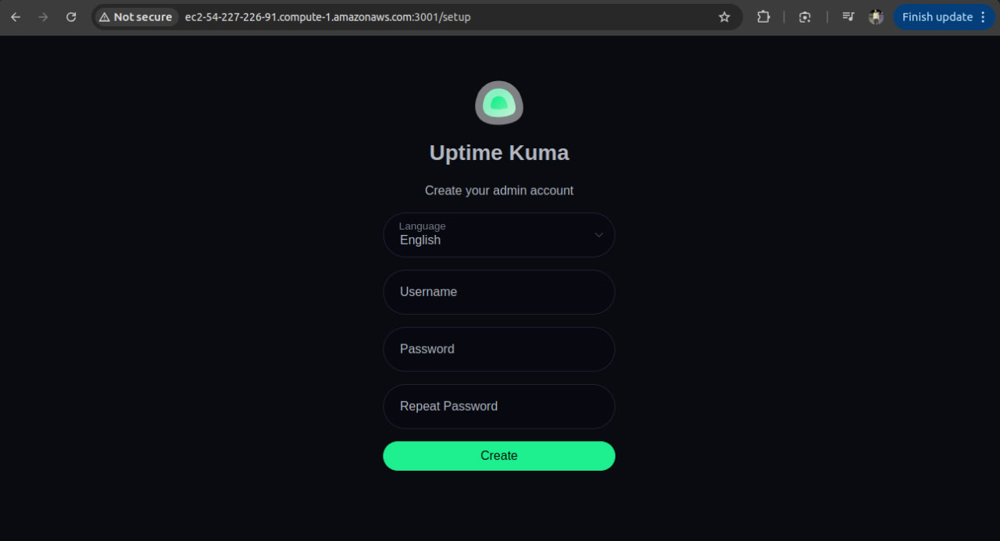

# Uptime Kuma Deployment on AWS

## Overview
This project automates the deployment of [Uptime Kuma](https://github.com/louislam/uptime-kuma) on AWS using Terraform, Jenkins, and Docker Compose. The deployment sets up the required AWS infrastructure, provisions an EC2 instance, installs Docker and Docker Compose, and then deploys Uptime Kuma using a Jenkins pipeline.

## Project Structure
```
.
├── aws_infrastructure      # Terraform files for AWS setup
│   ├── main.tf            # Defines resources such as EC2, security groups, and networking
│   ├── outputs.tf         # Outputs for generated values like public IP
│   ├── provider.tf        # AWS provider configuration
│   └── variables.tf       # Input variables for Terraform
├── docker-compose.yaml     # Docker Compose file to deploy Uptime Kuma
├── images                 # Screenshots of the setup
│   ├── infra.jpg          # AWS infrastructure diagram
│   ├── output.jpg         # Uptime Kuma running screenshot
├── Jenkinsfile            # Jenkins pipeline for deployment automation
└── README.md              # Project documentation
```

## Tools Used
- **Terraform**: Infrastructure as Code (IaC) for AWS resource provisioning
- **Jenkins**: CI/CD tool to automate deployment
- **Docker & Docker Compose**: Containerized deployment of Uptime Kuma
- **AWS (EC2, Security Groups, VPC)**: Cloud infrastructure

## Deployment Idea
1. **Terraform** provisions an EC2 instance with necessary security groups.
2. **Jenkins** automates deployment using a pipeline defined in the Jenkinsfile.
3. **Jenkins pipeline** connects to the EC2 instance via SSH, installs Docker and Docker Compose if not already installed, and removes any previous `docker-compose.yaml` file.
4. **Jenkins pipeline** copies `docker-compose.yaml` to the EC2 instance.
5. **Jenkins pipeline** starts the Uptime Kuma container using Docker Compose.
6. **Uptime Kuma** is accessible via the public DNS of the EC2 instance.

## How to Run
Follow these steps to deploy Uptime Kuma:

### 1. Clone the Repository
```sh
 git clone https://github.com/shehab-19/uptime-kuma-deployment.git
 cd uptime-kuma-deployment
```

### 2. Deploy Infrastructure with Terraform
```sh
 cd aws_infrastructure
 terraform init
 terraform apply -auto-approve
```
After applying Terraform, note the **Public IP** of the EC2 instance from the output.

### 3. Update Jenkinsfile
Open `Jenkinsfile` and replace the placeholder **Public IP** with the one from the Terraform output.

### 4. Run Jenkins Pipeline
1. Add the repository to Jenkins.
2. Run the pipeline to deploy Uptime Kuma using Docker Compose.

### 5. Access Uptime Kuma
Once the pipeline completes, open a browser and visit:
```
http://<EC2_PUBLIC_IP>:3001
```
Replace `<EC2_PUBLIC_IP>` with the actual public IP from Terraform.

## Output Screenshot


## Infrastructure Diagram


## Notes
- Ensure that **port 3001** is open in the security group.
- Use `terraform destroy` to clean up resources when done.

---

This deployment provides a fully automated way to set up Uptime Kuma monitoring on AWS using Infrastructure as Code and CI/CD tools. 🚀

